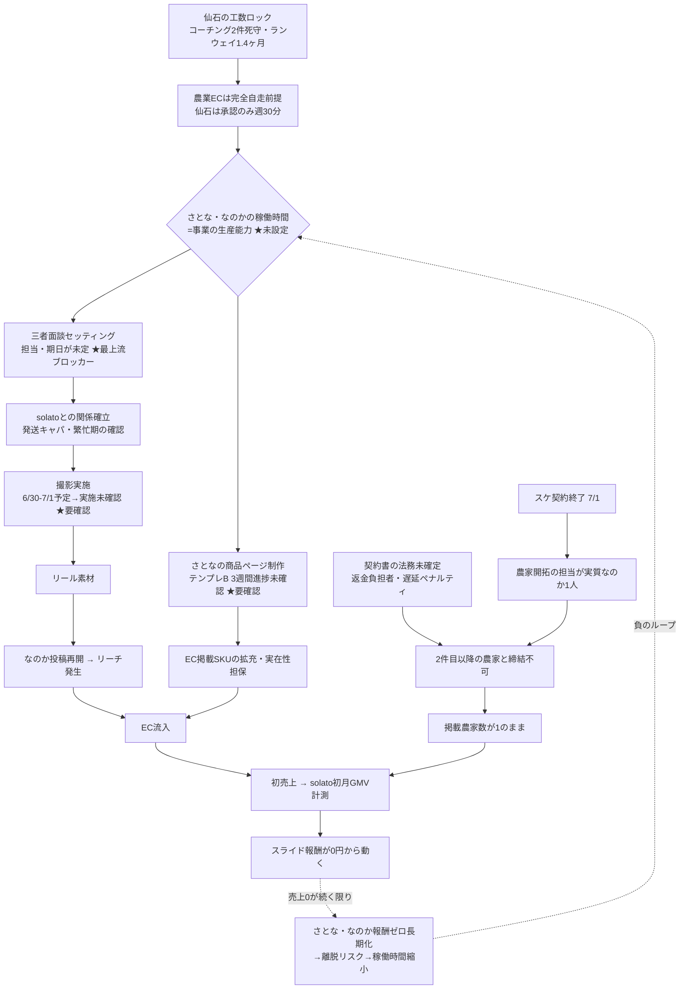

# 月商500万逆算計画 再検証 — 2026-07-02

前回分析（CSO/CFO向け戦略データ準備セッション）の3論点をリポジトリの一次情報と突き合わせて再検証した。

参照: agents/農業/context.md / context.md / digest.md / logs/2026-07/2026-07-01_EC戦略.md / logs/2026-07/2026-07-02_夜間リサーチ.md / 成果物/農業EC/data.js

---

## 0. 前提の所在確認（最初に言うべきこと）

リポジトリに**実在する**数字は1つだけ:

> agents/農業/context.md:40「3ヶ月目標: EC月商500万円 → メンバー月収12万円」

「農家5件×月商100万」も「農家3件×30-50万」も**どのファイルにも書かれていない**。両方とも会話上の分解であり、コミットされた根拠を持たない。つまり②の矛盾は「どちらが正しいか」以前に「どちらも未検証」が正確な状態。

### 付随して発見した不整合（契約書に載る数字なので要修正）

スタッフ報酬スライド（月商〜50万:12% / 50〜150万:6% / 150万超:3%）で月商500万を計算すると:
- 段階制（限界方式）: 50万×12% + 100万×6% + 350万×3% = **22.5万円**
- 一律3%方式: 500万×3% = **15万円**

どちらの解釈でも「月収12万」にならない（12万になるのは月商400万×一律3%のみ）。**契約書の数字が計算と合っていない**。さとなは期待値ギャップで逃げるタイプ。報酬の期待値がずれたまま走るのが一番危険な相手なので、提示前に必ず直す。

---

## ① 稼働時間ヒアリング質問リスト

稼働時間未設定＝この事業の生産能力が未知数のまま500万を掲げている状態。ただし2人のカルテ上、「週何時間働ける？」という管理型の聞き方はどちらにも逆効果。聞き方込みで設計する。

### 共通で取るべきデータ（聞き方は個別）

| # | 取りたいデータ | なぜ必要か |
|---|---|---|
| 1 | 週あたり実働可能時間（平日/週末別） | 生産能力の絶対値 |
| 2 | 7〜9月の他の予定（帰省・試験・バイト・農繁期） | 撮影期と夏商材のピークが直撃する |
| 3 | 作業単位あたりの実所要時間 | 「時間×速度」でないと逆算できない |
| 4 | 報酬ゼロ期間をいつまで許容できるか | 完全成果報酬×売上0円の持続限界 |
| 5 | 「これ以下になったら言ってほしい」最低ライン | 離脱の予兆を事前に定義する |

### さとな向け（承認欲求型・安全でないと開かない・将来接続で動く）

前置き: 「ブランディングライターの実績づくりとして、制作ペースを一緒に設計したい」— 管理ではなく将来接続として枠を出す。

1. テンプレートB、1農家分を埋めるのに実際どれくらいかかった？（→ 商品ページ1本あたりの実時間。3週間確認していないので進捗確認を兼ねる）
2. 今のペースだと週何本ならしんどくない？（→ 週次生産本数。「頑張れば何本？」と聞かない——期待値を上げると逃げる）
3. 平日と土日、どっちが動きやすい？時間帯は？（→ 承認・フィードバックを返すタイミング設計に直結）
4. 8月に忙しくなる予定ある？（→ 北海道・学生前提の帰省/試験リスク）
5. 報酬がスライド式で最初はほぼゼロになる。何ヶ月までなら納得して続けられそう？（→ 安全性を先に担保してから聞く。ここで薄い回答が返ってきたら赤信号）

### なのか向け（無能バレ恐怖型・管理されると止まる・現場で動く）

前置き: 「面白い数字が見えてきた」型の巻き込みで開く。「できてる？」の確認形式は全面禁止。

1. 農家さんのところ、週何回くらい行けそう？移動時間どれくらい？（→ 現場稼働の上限。なのかの生産性は現場滞在時間にほぼ比例する）
2. 撮影1回で何本くらい素材撮れる？1回あたりどれくらい時間かかる？（→ リール生産能力の単位あたり実測）
3. 三者面談、農家さん側の都合っていつ聞けそう？こっちで段取りするなら何があると楽？（→ 面談セッティングの担当と期日を「手伝う」形で確定させる。誰がやるか未定のまま——最大のボトルネック）
4. 7〜8月、農家さん側が一番忙しい時期っていつ？（→ 農繁期＝撮影も発送も詰まる時期の特定。なのかが答えられる領域なので自尊心を守れる質問）
5. 直紹介5,000円の件、声かけられそうな農家さん今何人くらいいる？（→ 開拓パイプラインの実数。「開拓しろ」ではなく手持ちを聞く）

### ヒアリング結果の使い方

2人の回答から「週あたり公開可能な商品ページ数」「週あたり投稿可能リール数」「月あたり接触可能農家数」の3つの生産レートを出す。これが揃って初めて逆算計画が計画になる。現状は生産能力ゼロ仮定でも無限大仮定でも成立してしまう。

---

## ② 「農家5件×100万」vs「農家3件×30-50万」の検証

### 結論: どちらも未検証だが、5件×100万は棄却水準。3件×30-50万すら楽観側

**月商100万/農家を物理に落とす:**
- 現SKUの客単価は¥2,980〜3,480。仮に平均3,000円 → 月330件 ≈ **1日11件の発送**
- とうもろこし5本セット換算で月1,650本の供給。個人農家の作付け規模の確認なしに置ける数字ではない
- 2026-07-01_EC戦略ログの否定AI自身が「注文集中時の農家キャパ超→キャンセル多発→ブランド毀損」を穴①に挙げている。5件×100万はこの指摘と正面衝突する

**集客側から逆算:**
- 業界データ（同ログ）: リール→ECの遷移率2〜8%、EC内の購入完了まで離脱85〜92%
- 月330件の注文 ← 訪問2,200〜4,100 ← **リール閲覧 月2.7万〜20万回/農家**
- 5農家分なら月14万〜100万再生。一方で現行計画のKPIは「6/23〜29で50フォロワー」。**4〜5桁足りない**
- 3件×30-50万でも1農家あたり月100〜170件（1日3〜6件発送）＋月1万〜10万再生が必要。これも現状実績0からは楽観

**したがって現実的な初期仮説は「1農家×月商10万」をまず検証すること。** solato 1件で月10万（約33件）が作れないなら、3件でも5件でも掛け算する土台がない。

### 確認すべきデータ（優先順）

| 優先 | データ | 取得方法 | 判定への効き方 |
|---|---|---|---|
| 1 | solatoの初月GMV（ローンチ済み・現在0円） | EC実績をそのまま計測 | 全仮説の分母。1農家あたり月商の実測値 |
| 2 | なのかの実リーチ（フォロワー数・リール平均再生・リンククリック数） | Instagramインサイト | 遷移率2-8%仮定の検証。集客の絶対量 |
| 3 | solatoの発送キャパ（週何件まで対応可能か・繁忙期はいつか） | 三者面談で直接確認 | 農家あたり月商の物理上限 |
| 4 | 農家開拓のリードタイム（声かけ→契約→掲載まで何日か） | 2件目の開拓で実測 | 「3ヶ月で3件 or 5件」の実現可能性。スケ不在で開拓担当はなのかのみ |
| 5 | 実客単価とリピート/定期便転換率 | EC実績 | 500万の「安定性」（単発バズ依存か積み上げか） |
| 6 | さとな・なのかの稼働時間（①の結果） | ヒアリング | 供給側の生産レート |

### データ品質の警告

- agents/農業/context.md は「農家候補0件確定」のまま——ルートcontext.md（solato掲載済み・ローンチ済み）と矛盾。**エージェントcontextが古い**
- data.js の「そらといちご」は season:'春' の商品を7月に in_stock で掲載中。季節逆行のSKUが載っている＝**掲載データの実在性・在庫連動が未検証**。これ自体が「農家が売れる状態か」の反証材料

---

## ③ ボトルネック依存関係グラフ

前回チェーン「なのか復帰待ち→農家開拓停止→撮影未実施→EC販売開始遅延」は**起点がすでに古い**。なのかは2026-07-01に復帰確認済み、ECはローンチ済み。現在の正しいグラフ:

### グラフから読めること

1. **最上流は「三者面談の段取り担当が決まっていない」こと。** なのか復帰で人は戻ったが、面談がセットされない限り「農家との関係確立→撮影→投稿」の幹線が全部止まったまま。担当と期日を決めるだけで解除できる最安のボトルネック。
2. **なのかが単一障害点。** 開拓・面談・撮影・投稿の4機能が全部なのか1本に載っている（スケ離脱でバックアップなし）。なのかのカルテは「1人になるとエンジンが切れる」。構造的に最も脆い。
3. **確認だけで潰せるノードが2つ:** 「6/30-7/1撮影は実施されたのか」「さとなのテンプレB進捗」。どちらも3週間〜数日単位で確認が空いている。①のヒアリングと同じ接触で回収できる。
4. **負のループが時限装置。** 売上0円→完全成果報酬0円→稼働低下→さらに売上遠のく。稼働時間ヒアリング（①）の質問4・5はこのループの残り時間を測るためにある。
5. **法務未確定は「2件目以降」だけを塞いでいる。** solato 1件の検証には効かないので、優先度は初売上検証より後でよい。500万計画に進む時点では必須。

### 統合結論

月商500万/3ヶ月は、現時点のデータでは分解方法（5×100 or 3×30-50）を議論する段階にない。**検証ゲートを「solato 1農家×月商10万」に置き直し、①のヒアリングで生産レートを実測してから逆算をやり直すのが正しい順序。** 500万という数字自体は契約書のスライド報酬と結びついているため、下方修正するなら報酬テーブルの月収試算（現状すでに12万と計算が合わない）と同時に直すこと。

---

## 【訂正追記 2026-07-02】前提の更新

本検証の「農家5件×100万も3件×30-50万もリポジトリに実在しない」という結論は、検証時点でCLAUDE.mdが未コミットの短縮版に置き換わっており、HEAD版(コミット済み・7/1)の記述が見えていなかったことによる。

HEAD版CLAUDE.mdには「EC月商(GMV)500万円 = 5〜10軒 × 月100件 × ¥5,000」と明記されていた。正しい分解は「農家5件×100万」ではなく「5〜10軒 × 月50万/軒(100件×¥5,000)」。1農家あたり1日3〜4件の発送・月1万〜10万リール再生水準。5×100万よりは現実的だが、依然として①solato初月GMV ②なのかの実リーチ での検証が前提である点は変わらない。

また報酬設計の「12万にならない」という指摘も訂正する。契約書(DocuSign・締結済み)第2条は段階制で、分母はGMVではなくSEN手数料収入。GMV500万→手数料収入150万(30%)→50万×12%+100万×6%=12万。「月商500万→月収12万」は正しい。
